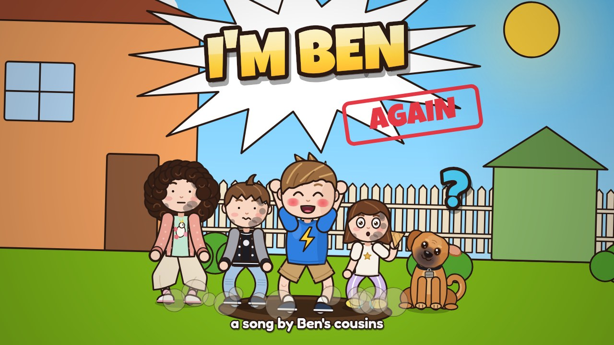
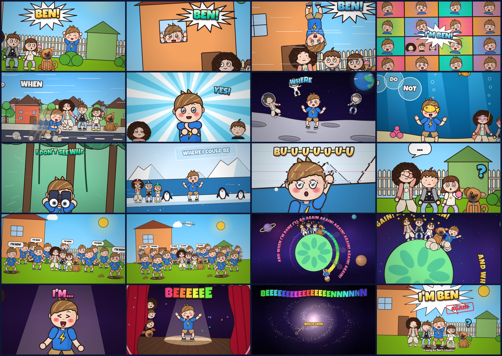

# I'm Ben Again — the music video

A 20-second cartoon music video for *I'm Ben Again*, the song Ben's cousins wrote about him, **drawn
entirely with code** and matched to the song's manic energy: a crash zoom on every "Ben", whip pans,
stutter zooms, beat-pulsed camera moves, and never a still frame.

Ben is drawn from his photo (tousled light-brown hair, very rosy cheeks, big grin) in his usual
t-shirt and shorts. His cousins, the three kids from *Rusty the Dog's Spacetime Adventure*, are the
audience, and they are not impressed. Rusty turns up too, mostly tilting his head.



- **Watch the video:** `output/im-ben-again.mp4` (1920×1080, 30 fps, with the song).
- **Watch it live in a browser:** open `index.html`. The same code draws each frame in real time,
  synced to `audio/im-ben-again.mp3`, with chapters, scrubbing, optional lyrics and a "Go again"
  button (on by default, because when he's done he'll go again).

## What happens

| Time | Lyric | On screen |
| --- | --- | --- |
| 0:00 | I'm Ben! Ben! Ben! Ben! | The cousins are having a quiet ice cream in the backyard. Ben pops up behind the bush, in the kitchen window, out of the lawn and upside-down from a branch, and the camera whips to each |
| 0:01 | I'm Ben I'm Ben I'm Ben I'm Ben | A pop-art grid that doubles on every "Ben": 1, 2, 4, 8, 16 Bens. One panel is the cousins |
| 0:02 | And when I'm done I'll go again | He sprints past the cousins, stops ("DONE!"), then laps the block so fast he comes straight back in from the left |
| 0:03 | 'Cause I'm Ben, yes I'm Ben | Hero pose on a spinning sunburst, three crash zooms; the cousins pop up in the corners to side-eye it |
| 0:04 | Where I'll go I do not know, I don't see where I could be | The moon (the cousins in their bubble helmets from the Rusty video), the sea bed, the jungle, an ice floe with penguins. Ben shrugs in all of them |
| 0:07 | bu-u-u-ut | Everything freezes and glitches while the camera stutters in on his raised finger |
| 0:08 | I'm Ben, yes I'm Ben | The big reveal, then a cut to the cousins: deadpan, a facepalm, a dropped ice cream and a confused dog |
| 0:09 | I'm Ben I'm Ben I'm Ben I'm Ben | A wave of clones pops out of the lawn on every "Ben" until the cousins are surrounded |
| 0:11 | And when I'm done I'll go again | Ben laps a tiny planet faster and faster, hurdling the cousins, until he's a rainbow ring; the lyric chases him round the orbit |
| 0:14 | Because, I'm, | A spotlight on a stage, two crash zooms and one enormous breath |
| 0:15 | beeeeennnnn | The note blows the curtains open, then launches him: the camera pulls back from the Earth to the solar system to the galaxy while the word grows one letter at a time |
| 0:19 | (the last hit) | He crash-lands in front of his sooty cousins. *I'M BEN. AGAIN.* |



## How it was made

1. **Listening to the song.** The vocal was separated from the music with Demucs, and Whisper found
   the start and end of every sung word. Those times were then checked by hand against the gaps in
   the vocal's loudness (`tools/analysis/lyrics.json`). Whisper missed the "bu-u-u-ut" and cut the
   three-second "beeeeennnnn" short. The kick drum is a steady 212 BPM punk two-step (one kick every
   0.283 s), so the camera pulses on the kick. The vocal level drives Ben's lip-sync, and every "Ben"
   is a hit: a crash zoom, a pop, a clone or a slam.
2. **Drawing.** Every frame is a pure function of time (`renderFrame(ctx, t)`). The engine (camera,
   rig, effects, shot sequencer) comes from the Rusty video, and the three cousins and Rusty are drawn
   exactly as they were there. Ben is a new character on the same rig, and the cousins got new
   weirded-out faces: side-eye lids, dot-eyed deadpan, a raised eyebrow, gloom lines, sweat, spiral
   dizzy eyes, a grimace and a facepalm.
3. **Rendering.** `tools/render.mjs` runs the same scripts in Node on a Skia canvas
   (`@napi-rs/canvas`) across worker processes, pipes raw frames to ffmpeg (H.264, 1080p30) and adds
   the song.

```
src/
  core.js        maths, easing, beat clock (212 BPM), drawing helpers        (from the Rusty video)
  timing.js      generated: word timings + audio envelopes
  characters.js  the cousins, Rusty, and Ben; faces, hands, hair, t-shirt and shorts
  moves.js       dance moves on the beat                                     (from the Rusty video)
  world.js       backyard, street, moon, sea bed, jungle, ice floe, stage, Earth, galaxy...
  fx.js          snapCam (the crash-zoom camera), glitch, text on a circle, impacts, shockwaves...
  captions.js    lyric lookups, Ben's lip-sync, optional karaoke captions
  shots.js, shots2.js, shots3.js   the storyboard
  video.js       picks the shot for each moment, transitions, finishing touches
tools/
  render.mjs     render the MP4        frames.mjs      contact sheet of chosen timestamps
  sheet.mjs      character sheet       storyboard.mjs  README images
  youtube.mjs    YouTube thumbnail + lyric captions (youtube/)
  analysis/      song analysis (Python)
```

## Re-rendering

Requires Node 18+ and `ffmpeg` on the PATH (or `FFMPEG=/path/to/ffmpeg`).

```bash
npm install
npm run render                                    # full 1080p video -> output/im-ben-again.mp4
npm run render -- --start 9 --end 11.3 --width 960 --height 540 --out output/clones.mp4
node tools/frames.mjs output/check.png 0.3 4.4 7.9 # quick contact sheet of timestamps
```

For YouTube, `npm run render:youtube` renders `output/im-ben-again-youtube.mp4` at YouTube's recommended
upload settings (two-pass H.264 at 8 Mb/s, AAC 384 kb/s), and `node tools/youtube.mjs` makes the custom
thumbnail and the lyric captions in `youtube/`. The title, description, tags and upload steps are in
[`youtube/upload.md`](youtube/upload.md).

Re-running the song analysis needs Python with `demucs`, `faster-whisper`, `librosa` and `soundfile`:

```bash
python -m demucs --two-stems vocals song.wav                          # -> vocals.wav, no_vocals.wav
python tools/analysis/transcribe.py large-v3-turbo vocals16k.wav vocals.json
python tools/analysis/beat_grid.py no_vocals.wav                      # tempo/phase used in src/core.js
python tools/analysis/make_timing.py tools/analysis/lyrics.json song.wav vocals.wav src/timing.js
```

## Credits

- Song: *I'm Ben Again*, words by Ben's cousins (`audio/`).
- Fonts: Luckiest Guy (Apache 2.0) and Fredoka (SIL Open Font License). The licence texts are in `fonts/`.
