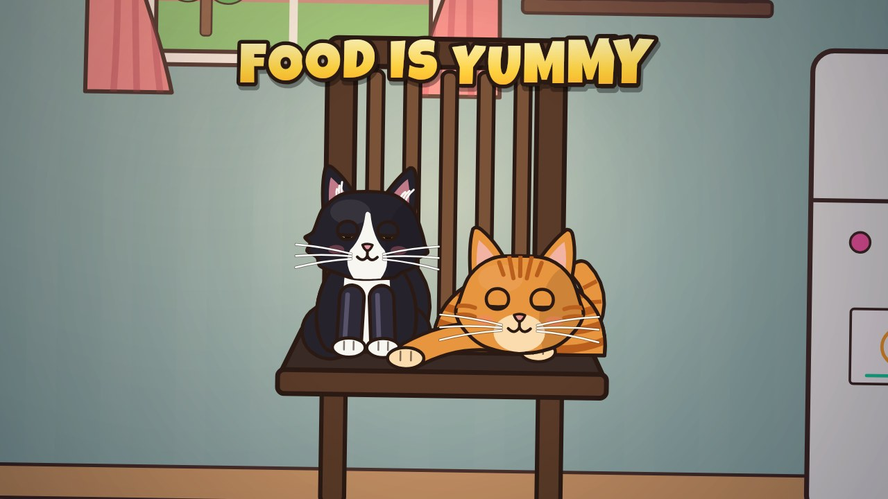
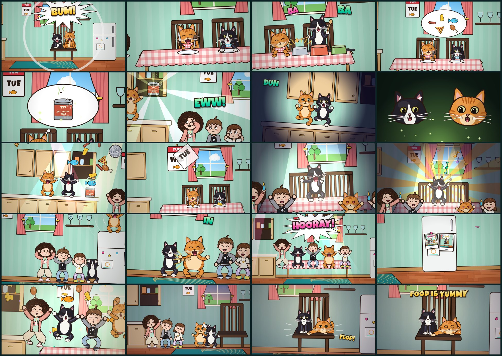

# Food Is Yummy — the music video

A 28-second cartoon music video for *Food Is Yummy*, **drawn entirely with code**. The two cats from
the photo do the singing: the fluffy tuxedo and the big ginger tabby trade lines. The three kids from
*Rusty the Dog's Spacetime Adventure* and *I'm Ben Again* set the table, react to the old tin, and join
in on the hoorays. As in the other two videos there are crash zooms on the hits, a camera that pulses on
every kick once the drums come in, and no still frames.



- **Watch the video:** `output/food-is-yummy.mp4` (1920×1080, 30 fps, with the song).
- **Watch it live in a browser:** open `index.html`. The same code draws each frame in real time,
  synced to `audio/food-is-yummy.mp3`, with chapters, scrubbing, optional lyrics and a "Seconds" button
  (on by default, so it plays again).

## What happens

| Time | Lyric | On screen |
| --- | --- | --- |
| 0:00 | Bum! | Both cats pop up on the dining chair from the photo and shout it at the camera |
| 0:00 | Food is yummy | Dinner time: the cats at the table in napkin bibs, the ginger with her knife and fork up, while the kids bring the food. Three crash zooms, one per word |
| 0:02 | bum ba ba bum | The tuxedo jumps on the table and plays three upturned saucepans with wooden spoons, with a zoom on every hit |
| 0:02 | It tastes good like... | The ginger dreams of dinner in a thought bubble, then of a question mark, then of a tin |
| 0:04 | ...that old thing in the cupboard | A whip pan to the kitchen. The cupboard rattles and glows. The ginger opens it: a dusty tin, *BEST BEFORE 1972*, with a fly. The kids: "EWW!" The tin falls onto the counter on the drum hit |
| 0:06 | dun da-da dun, da-da dun! | Lights out for the heist. The cats tiptoe toward the tin, freezing and staring at the camera on every "dun". On the last one the tuxedo pops the lid |
| 0:08 | | Silence, a green glow, and two pairs of pupils going very round |
| 0:08 | I eat every day | The drop: the tin is magic. Food erupts out of it, a disco ball comes down and everyone dances in the food. On "every day" the calendar flips through the whole week in one second, with a new dinner on the plates each day |
| 0:11 | a-a-a a-a-a aaay! | The tuxedo takes the stage (the table) with a fork for a microphone. Nine staccato notes, nine zooms, then the long note in a sunburst while the fans wave lighters |
| 0:13 | a-a-AY, ay! | The ginger yodels from the top of the fridge. The glasses crack on the high notes and shatter on the top one; everyone covers their ears |
| 0:16 | Yum in my tum | After all that, the ginger has a very round tummy, and the tuxedo drums on it |
| 0:17 | hip hip hooray! | The kids jump on the first "hip", the cats on the second, and everyone on "hooray", with confetti |
| 0:18 | (hooray!) | Four camera flashes on the four echo hits: four polaroids of the best bits, slapped onto the fridge |
| 0:20 | (the held chord) | Slow motion: everyone hangs in mid-air while the camera glides past their faces. When the chord stops, they all drop |
| 0:22 | | Dusk. Very full. The kids yawn, the cats waddle to the chair, hiccupping on the little hits, and jump |
| 0:24 | (the last hit) | They land in exactly the pose from the photo, the tuxedo sitting and the ginger lying with a paw stretched out. A slow blink at the camera, and they fall asleep. The kids tiptoe in: "shh!" |



## How it was made

1. **Listening to the song.** The vocal was separated from the music with Demucs, and Whisper found
   the start and end of every sung word. Whisper struggled with the scat ("dun da-da dun") and the
   "a-a-a" runs, so those timings were checked by hand against the gaps in the vocal's loudness and its
   pitch (`tools/analysis/lyrics.json`). The song is 90 BPM with one kick every 0.666 s. The drums only
   groove from the drop at 8.7 s to the held chord at 20.1 s, so the camera pulses on the kick only in
   that stretch. The verse is sparse, so its crash zooms land on the words instead. The vocal level
   drives the lip-sync, and each line is given to one cat (`RV.SINGERS` in `src/captions.js`).
2. **Drawing.** Every frame is a pure function of time (`renderFrame(ctx, t)`). The engine (camera,
   rig, effects, shot sequencer) comes from the Rusty and Ben videos, and the kids are drawn exactly as
   they were there. The cats are a new rig (`src/cats.js`) drawn from the photo: sitting, standing and
   "loaf" poses, cat faces (heart eyes, squeezed eyes, the ω mouth, a yowl with fangs), and a front leg
   that crosses the face is always drawn in front of the head. The kitchen (`src/kitchen.js`) takes its
   mint wall, red wood floor, teal rug with gold swirls and dark slat-back chair from the photo too.
3. **Checking.** Every shot was checked frame by frame, with particular attention to limbs, props and
   text crossing faces.
4. **Rendering.** `tools/render.mjs` runs the same scripts in Node on a Skia canvas
   (`@napi-rs/canvas`) across worker processes, pipes raw frames to ffmpeg (H.264, 1080p30) and adds
   the song.

```
src/
  core.js        maths, easing, beat clock (90 BPM), drawing helpers         (from the Rusty video)
  timing.js      generated: word timings + audio envelopes
  characters.js  the three kids (and the rig they share)                      (from the Rusty and Ben videos)
  cats.js        the two cats: poses, faces, paws, tails, bibs
  moves.js       dance moves on the beat                                      (from the Rusty video)
  world.js       clouds, trees, fish and other props                          (from the Rusty and Ben videos)
  kitchen.js     the kitchen, the chair, the table, the magic tin, pots, food, polaroids
  fx.js          snapCam (the crash-zoom camera), impacts, confetti, text slams...
  captions.js    lyric lookups, who sings which line, lip-sync, optional karaoke captions
  shots.js, shots2.js, shots3.js   the storyboard
  video.js       picks the shot for each moment, transitions, finishing touches
tools/
  render.mjs     render the MP4        frames.mjs      contact sheet of chosen timestamps
  sheet.mjs      character sheet       storyboard.mjs  README images
  youtube.mjs    YouTube thumbnail + lyric captions (youtube/)
  analysis/      song analysis (Python)
```

## Re-rendering

Requires Node 18+ and `ffmpeg` on the PATH (or `FFMPEG=/path/to/ffmpeg`).

```bash
npm install
npm run render                                    # full 1080p video -> output/food-is-yummy.mp4
npm run render -- --start 8.6 --end 11.3 --width 960 --height 540 --out output/drop.mp4
node tools/frames.mjs output/check.png 2.5 9.5 15.8 # quick contact sheet of timestamps
```

For YouTube, `npm run render:youtube` renders `output/food-is-yummy-youtube.mp4` at YouTube's recommended
upload settings (two-pass H.264 at 8 Mb/s, AAC 384 kb/s), and `node tools/youtube.mjs` makes the custom
thumbnail and the lyric captions in `youtube/`. The title, description, tags and upload steps are in
[`youtube/upload.md`](youtube/upload.md).

Re-running the song analysis needs Python with `demucs`, `faster-whisper`, `librosa` and `soundfile`:

```bash
python -m demucs --two-stems vocals song.wav                          # -> vocals.wav, no_vocals.wav
python tools/analysis/transcribe.py large-v3-turbo vocals16k.wav vocals.json
python tools/analysis/beat_grid.py no_vocals.wav                      # tempo/phase used in src/core.js
python tools/analysis/make_timing.py tools/analysis/lyrics.json song.wav vocals.wav src/timing.js
```

## Credits

- Song: *Food Is Yummy* (`audio/`).
- Fonts: Luckiest Guy (Apache 2.0) and Fredoka (SIL Open Font License). The licence texts are in `fonts/`.
