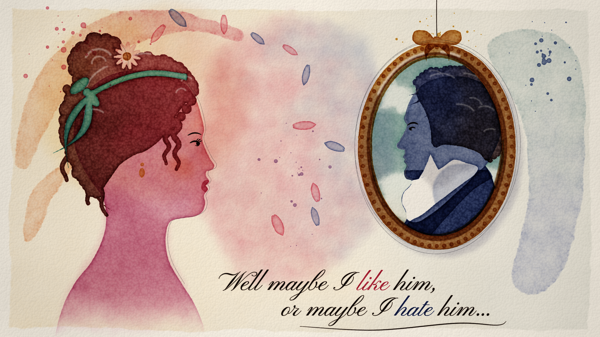

# The Art of Making Up My Mind: watercolour music video

A painterly, heavily stylised watercolour animation for the song *The Art of Making Up My Mind*,
which is Elizabeth Bennet's running argument with herself about Mr Darcy.

**Status: code version 2 ready for review.** Version 2 drops the jointed puppets: every scene is
now painted onto the page as you watch, with flowing colour and light. Once the review is signed
off, the same code will render the final video frame by frame.



## Concept

- **Painted on the page.** Nothing slides or pops in. Each scene starts as bare paper and a
  pencil line, and the paint floods out from where the brush touches: faces from the eye, a
  sunset from the sun, a gilt frame running round both ways from its bow, Darcy from his boots up.
- **No puppets.** Figures are whole painted silhouettes. They come alive through the paint:
  hems, ribbons and coat tails move in the air, busts breathe, and a figure turns by flowing
  into its own mirror image.
- **Two warring pigments.** Elizabeth is rose madder ("maybe I like him") and Darcy is indigo
  ("maybe I hate him"). Their colours tug across the page and marble into violet on "the art of
  making up my mind".
- **Light.** Candlelight, sunsets, lightning, sunbeams and glints are painted into their own
  light layer and glow over the paper.
- **Hand-lettered lyrics**, written on word by word in time with the vocal, in Pinyon Script
  (a Regency copperplate hand). *like*, *heart* and *feel* are painted in rose; *hate*, *worst*,
  *rude* and *wrong* in indigo; *mind* and *eyes* in violet. Lyrics can be switched off in the player.

## Scenes

| Time | Scene |
| --- | --- |
| 0:00 | Title: a drop of rose blooms on the bare sheet; light passes over as the title is inked in |
| 0:03 | The Assembly Rooms: the ballroom floods in by candlelight; on "worst" she turns away and her fan comes up |
| 0:13 | On my mind: a sunset floods into her silhouette and a tiny Darcy is painted on the hill; her heart glows, then an indigo drop marbles through it |
| 0:29 | Face to face: her face floods out from her eye, then his; rose and indigo tug across the page, and she turns away on "hate" |
| 0:56 | The storm: rain, and lightning on "rude" and "mean"; his words ("your inferiority", "a degradation") are lifted out of the sky, then the rain runs them down the page |
| 1:08 | Tall and strong: Pemberley at golden hour, painted from his boots up as the camera tilts; on "strong", wind, sun rays and glitter on the lake |
| 1:14 | A certain way: warmth floods out from her blush and roses open on the beat |
| 1:21 | The sisters: they paint in one per beat, lean in to whisper, and turn their backs on "wrong" |
| 1:25 | The portrait: his painted eye, then his face and the gilt frame flood out; a sunbeam crosses the gallery |
| 1:52 | The dance: palms almost touching, trailing colour; they turn away on "hate" and back on "like" |
| 2:09 | Mind made up: a violet heart floods open between them |
| 2:14 | Dawn: together in the mist as the sun rises; the paint dries and fades back into the paper |

## How it's made

Everything is generated in code, with no image model. Each frame is painted by a small WebGL2
watercolour engine.

| File | Role |
| --- | --- |
| `index.html` | The review player: plays the song and paints the animation in sync; scrubber with song sections, scene list, lyrics toggle, quality and full screen. |
| `frame.html` | Renders any single moment (`frame.html?t=95`), for checks and for the final frame-by-frame video render. |
| `js/engine.js` | Watercolour renderer: procedural cold-press paper, and washes with edge darkening, granulation, flow, wet-in-wet and marbled mixing, dry brush, lifting and soft reveals, combined subtractively. Paint can flood through a shape from seed points, keep flowing while wet, sway, drip, and morph into another shape or its mirror image. Also a light layer (glows, rays, glints), figure groups (a figure reserves the paper beneath it), ink and graphite layers, wet-edged scene transitions where the old painting runs, and the lyric overlay. |
| `js/sdf.js`, `js/flood.js` | Turn any Canvas2D drawing into a signed distance field mask, and bake the flood field (how far paint travels inside the shape from its seed points). |
| `js/figures.js`, `js/people.js` | Elizabeth and Darcy profiles, full-figure shapes and poses, the four sisters, and props (Pemberley, the temple, oak, chandeliers, roses). |
| `js/cast.js` | Bakes each figure, in a pose, into whole painted silhouettes (one per colour) and paints them on: flooding in, swaying, turning, merging poses. |
| `js/film.js` | Scene schedule, transitions and the word-by-word lyric overlay. |
| `js/scenes/*.js` | One file per scene, each timed to the lyrics and beats. |
| `js/timing.js`, `timing/lyrics-timing.json` | Word-level lyric timings, song sections and the 264 detected beats (about 108 BPM, B♭ major, 2:31). |
| `lab/` | Test pages for the engine effects and the cast. |

To run locally, put the song at `audio/the-art-of-making-up-my-mind.mp3` (it is not committed), then:

```sh
python3 -m http.server 8765 --directory pride-and-prejudice-watercolour
# open http://localhost:8765/index.html  (or frame.html?t=95 for a single frame)
node pride-and-prejudice-watercolour/tools/render-still.mjs \
  "http://localhost:8765/frame.html?t=95&scale=2" still-4k.png 3840 2160 __done
```

Fonts: Pinyon Script and IM Fell English are used under the SIL Open Font License (see `fonts/`).
