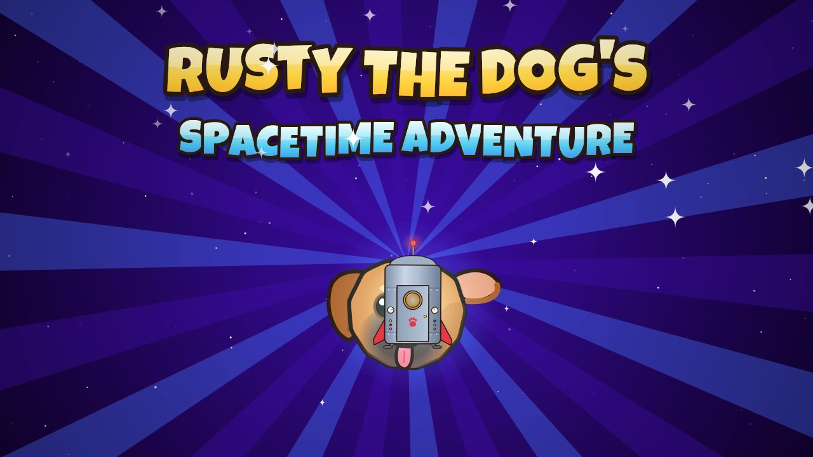
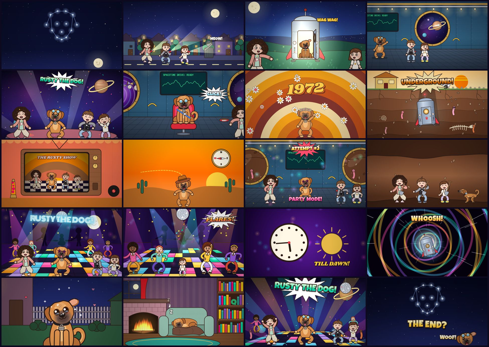

# Rusty the Dog's Spacetime Adventure — the music video

A 6½-minute cartoon music video for the song, **drawn entirely with code**. There is no
hand animation and there are no image assets: Rusty, the three kids, the spacetime machine,
the 1972 disco bunker and everything else are drawn on an HTML canvas, frame by frame,
in time with the music.



- **Watch the video:** `output/rusty-the-dogs-spacetime-adventure.mp4`
- **Watch it live in a browser:** open `index.html`. The same animation code draws each
  frame in real time, synced to `audio/rusty-the-dogs-spacetime-adventure.mp3`. It has
  chapters, scrubbing and a lyrics on/off toggle, and it works straight from disk.

## What's in it

| Section | What happens |
| --- | --- |
| Intro | A dog-shaped constellation appears star by star, a streak of light lands in a field, and the title card follows |
| Verse 1 | Rusty goes missing, the kids search the street with torches, then find him in a glowing metal box that is bigger on the inside |
| Chorus 1 | A dance party in space on an asteroid: a pop-art Rusty grid, bubble helmets, and a conga line around a tiny planet |
| Verse 2 | Rusty's doggy seatbelt, the big red button, the spinning room, blacking out, *1972!*, and the "underground" reveal |
| Chorus 2 | A 70s-style dance in an underground cavern: dancing worms in top hats and *The Rusty Show* on a retro TV |
| Verse 3 | "I aimed for the west" (cowboy hat, tumbleweed), four failed escape attempts, digging, and crashing into a disco |
| Chorus 3 / Bridge | Neon disco with a light-up floor, dancers in flares, Rusty howling, a painted velvet moon, and "TIME!" |
| Verse 4 | Through the tunnel of light, then home. Puppy eyes, a group hug, checking the box in all weathers, and sleeping by the fire |
| Finale / Outro | A dream-world finale with fireworks, then the box whooshes off into the stars and the constellation comes back: *The End?* |



The song's lyrics appear karaoke-style: each word lights up as it's sung. In the choruses,
every "Rusty the dog!" lands as a big title slam.

## How it was made

1. **Listening to the song.** The vocals were separated from the music with Demucs. Whisper
   then picked out the start and end time of every sung word, and those times were matched
   against the lyric sheet (`tools/analysis/`). The drums were measured as a very steady
   176 BPM beat grid, so dances, camera bumps and cuts land on the beat. The loudness of the
   vocal drives the mouth movements, so whoever is singing lip-syncs.
2. **Drawing.** Every frame is a pure function of time (`renderFrame(ctx, t)`), so any frame
   can be drawn in any order. The ~95 shots live in `src/shots*.js`. Characters are rigged
   in `src/characters.js`: bendable limbs, facial expressions and dance moves.
3. **Rendering.** `tools/render.mjs` runs the same scripts in Node on a Skia canvas
   (`@napi-rs/canvas`) across several worker processes. It pipes the raw frames to ffmpeg
   (H.264, 1080p30) and adds the song as the soundtrack.

```
src/
  core.js        maths, easing, beat clock, drawing helpers, camera
  timing.js      generated: word-level lyric timings + audio envelopes
  characters.js  Rusty (front / side / sleeping / head) and the three kids (+ 1972 dancers)
  moves.js       dance moves and poses on the beat
  world.js       sets and props: field, spacetime machine, ship interior, underground, disco, home...
  fx.js          sunbursts, confetti, fireworks, text slams, speed lines...
  captions.js    karaoke captions and lip-sync
  shots.js, shots2.js, shots3.js   the storyboard
  video.js       picks the shot for each moment, draws transitions and finishing touches
tools/
  render.mjs     render the MP4          frames.mjs  contact sheets of chosen timestamps
  patch.mjs      redraw one character's frames in an existing MP4
  sheet.mjs      character sheet         storyboard.mjs  README images
  analysis/      song analysis (Python)
```

## Re-rendering

Requires Node 18+ and `ffmpeg` on the PATH.

```bash
npm install
npm run render                                    # full 1080p video -> output/
npm run render -- --start 70 --end 95 --width 960 --height 540 --out output/chorus.mp4
node tools/frames.mjs output/check.png 30 75 140  # quick contact sheet of timestamps
```

Useful flags for `render.mjs`: `--crf` (quality, lower = better), `--preset`, `--workers`, `--fps`.

### Fixing one character without re-rendering everything

After changing how one character is drawn, `tools/patch.mjs` redraws only the frames that
character appears in and splices them into an existing full-quality render at its keyframes.
Every other stretch of the video keeps its original encoded bytes. For example, after a change
to the big sister (`big`; the others are `boy` and `little`):

```bash
node tools/patch.mjs --master old-1080p.mp4 --out new-1080p.mp4 --who big
```

The existing render must come from `tools/render.mjs` with its default settings, so the new
pieces match it.

Re-running the song analysis requires Python with `demucs`, `faster-whisper`, `librosa` and `soundfile`:

```bash
python -m demucs --two-stems vocals song.wav                            # -> vocals.wav
python tools/analysis/transcribe.py large-v3-turbo vocals16k.wav vocals.json
python tools/analysis/transcribe.py large-v3-turbo song16k.wav mix.json
python tools/analysis/align_lyrics.py vocals.json mix.json lyrics.json
python tools/analysis/make_timing.py lyrics.json song.wav vocals.wav src/timing.js
python tools/analysis/beat_grid.py song.wav                             # tempo/phase used in src/core.js
```

## Credits

- Song: *Rusty the Dog's Spacetime Adventure* (`audio/`).
- Fonts: Luckiest Guy (Apache 2.0), Fredoka, Shrikhand, VT323 and Monoton (SIL Open Font License).
  The licence texts are in `fonts/`.
