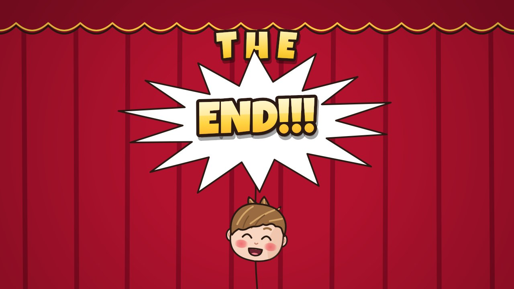
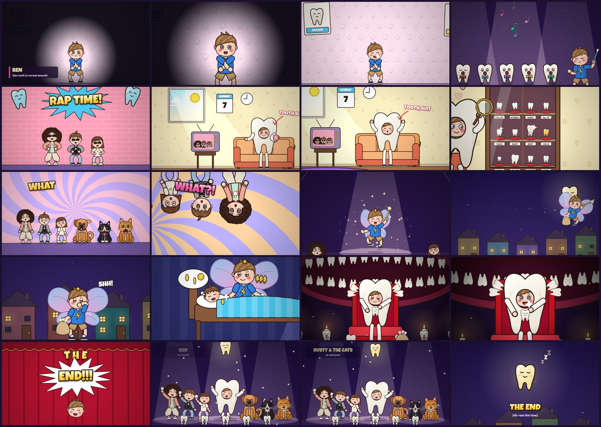

# He Likes Teeth — the music video

A 54-second cartoon music video for *He Likes Teeth*, the cousins' second song about Ben, **drawn
entirely with code**. This one is weirder and slower than *I'm Ben Again*. The shots are long, and the
camera mostly glides and pushes in slowly. It only snaps where the song shouts ("what what?!", "END!!!").
Ben, the cousins, Rusty and the two cats are drawn exactly as in the earlier videos. New this time: Ben's
tooth suit, tooth-fairy Ben, and a choir of singing teeth in bow ties.



- **Watch the video:** `output/he-likes-teeth.mp4` (1920×1080, 30 fps, with the song).
- **Watch it live in a browser:** open `index.html`. The same code draws each frame in real time,
  synced to `audio/he-likes-teeth.mp3`, with chapters, scrubbing, optional lyrics and an "Again" button.

## What happens

| Time | Lyric | On screen |
| --- | --- | --- |
| 0:00 | Ben be like, | A documentary interview: Ben alone in a spotlight, staring at the camera. *BEN: likes teeth (a normal amount)* |
| 0:02 | I'm not obsessed, | A very slow push in. Then a long pause. His eye twitches. A tooth floats past |
| 0:04 | I just really like teeth! | A big toothy grin, and the camera pulls back: the wall behind him is covered in teeth |
| 0:06 | (he likes teeth, oooooooh, he likes teeth) | The backing singers: five teeth in bow ties under a spotlight, swaying, while Ben conducts with a toothbrush. On the high "OOOH" they float off the floor |
| 0:13 | Rap time! | The beat drops. The cousins against a pink brick wall, sunglasses dropping onto their faces one at a time |
| 0:14 | He's sitting in his tooth suit on a lazy Sunday morning | Morning sun on the living room. Ben on the sofa in a full tooth costume with a mug of cocoa, while the cousins rap the story on the old TV |
| 0:17 | admiring his collection of human teeth! | His glass cabinet of teeth on velvet cushions (MOLAR, WOBBLY, No. 47, GOLD...) and a magnifying glass. One tooth winks back |
| 0:19 | Everyone be like what what!? | Everyone (the cousins, Rusty and the cats) in a row against a turning spiral: deadpan, then a double take on every "what" |
| 0:21 | Everyone be like what what?! | The second time the whole world rolls upside down |
| 0:22 | And then Ben admitted that he was a tooth fairy! | A shy confession in a spotlight. On "fairy!" a poof of glitter: wings, a star and a wand. The cousins' jaws drop |
| 0:25 | He snuck into the children's houses at night that right! | He flies across the night sky past a tooth-shaped moon, lands in the street, and tells us: shh! |
| 0:28 | He took away all their teeth and gave them money!? | A cousin asleep. Ben leans over the bed, swaps the tooth under the pillow for a coin, and the sleeper dreams of money |
| 0:31 | (Maybe he is obsessed after all) | The slowest shot: Ben's secret room. A giant mosaic mouth made of teeth that slowly breathes and chomps once, candles, and Ben on a throne of teeth, stroking a tooth in his lap. On "all" he turns to us and grins |
| 0:37 | Theeeeeeee, END!!! | The curtains close letter by letter, T, H, E... and slam on "END!!!". Ben pokes his head through |
| 0:40 | (He likes teeth, oooooooh...) | It isn't over: the curtains reopen for an encore with everyone swaying under the tooth moon, and the credits roll |
| 0:50 | | The tooth moon yawns and falls asleep. *THE END (for real this time)* |



## How it was made

1. **Listening to the song.** The vocal was separated from the music with Demucs, and Whisper found
   the start and end of every sung word. Whisper heard "tooth suit" as "pool suit", stretched words over
   the long silences in the first verse, and missed the second half of the song until it was run on that
   part on its own. All the timings were then checked by hand against the vocal's loudness and pitch
   (`tools/analysis/lyrics.json`). The song is a slow hip-hop groove at 77.5 BPM. The drums play only
   in the rap and the encore, so the camera pulses gently on the beat only there. It has a false ending:
   "THE END!!!" at 0:37, then an encore.
2. **Drawing.** Every frame is a pure function of time (`renderFrame(ctx, t)`), on the engine from the
   earlier videos. New in `src/teeth.js`: teeth with little faces, the tooth suit (Ben's face through a
   hole, his arms and legs out of the sides and roots), fairy wings (a new costume layer on the kids'
   rig, drawn behind the body), the wand and sack, the cabinet, the living room, the night street, the
   bedroom, the shrine and the throne.
3. **Who sings.** The cousins tell the story, Ben says his own lines, the teeth sing the backing vocals,
   and everyone does "what what" (`RV.SINGERS` in `src/captions.js`).
4. **Checking.** Every shot was checked frame by frame for hands, props, text and scenery crossing faces.
   For example, Ben's conducting hand and his cocoa mug were moved off his face, and the floating tooth
   was moved off his head.
5. **Rendering.** `tools/render.mjs` runs the same scripts in Node on a Skia canvas
   (`@napi-rs/canvas`) across worker processes, pipes raw frames to ffmpeg (H.264, 1080p30) and adds
   the song.

```
src/
  core.js        maths, easing, beat clock (77.5 BPM), drawing helpers        (from the Rusty video)
  timing.js      generated: word timings + audio envelopes
  characters.js  the cousins, Rusty and Ben (plus the new costume hooks)       (from the earlier videos)
  cats.js        the two cats                                                  (from Food Is Yummy)
  moves.js       dance moves on the beat                                       (from the Rusty video)
  world.js       stars, houses, clouds, curtains and other props               (from the earlier videos)
  teeth.js       teeth, the tooth suit, the fairy kit, the collection, the new sets
  fx.js          snapCam (the camera), sparkles, confetti, text slams...
  captions.js    lyric lookups, who sings which line, lip-sync, optional karaoke captions
  shots.js, shots2.js, shots3.js   the storyboard
  video.js       picks the shot for each moment, transitions, finishing touches
tools/
  render.mjs     render the MP4        frames.mjs      contact sheet of chosen timestamps
  sheet.mjs      character sheet       storyboard.mjs  README images
  youtube.mjs    YouTube thumbnail + lyric captions (youtube/)
  analysis/      song analysis (Python)
```

## Re-rendering

Requires Node 18+ and `ffmpeg` on the PATH (or `FFMPEG=/path/to/ffmpeg`).

```bash
npm install
npm run render                                    # full 1080p video -> output/he-likes-teeth.mp4
npm run render -- --start 19.5 --end 22.7 --width 960 --height 540 --out output/what-what.mp4
node tools/frames.mjs output/check.png 5.6 20.7 39.7 # quick contact sheet of timestamps
```

For YouTube, `npm run render:youtube` renders `output/he-likes-teeth-youtube.mp4` at YouTube's recommended
upload settings (two-pass H.264 at 8 Mb/s, AAC 384 kb/s), and `node tools/youtube.mjs` makes the custom
thumbnail and the lyric captions in `youtube/`. The title, description, tags and upload steps are in
[`youtube/upload.md`](youtube/upload.md).

Re-running the song analysis needs Python with `demucs`, `faster-whisper`, `librosa` and `soundfile`:

```bash
python -m demucs --two-stems vocals song.wav                          # -> vocals.wav, no_vocals.wav
python tools/analysis/transcribe.py large-v3-turbo vocals16k.wav vocals.json
python tools/analysis/beat_grid.py no_vocals.wav                      # tempo/phase used in src/core.js
python tools/analysis/make_timing.py tools/analysis/lyrics.json song.wav vocals.wav src/timing.js
```

## Credits

- Song: *He Likes Teeth* by Ben's cousins, made with Suno (`audio/`).
- Fonts: Luckiest Guy (Apache 2.0) and Fredoka (SIL Open Font License). The licence texts are in `fonts/`.
